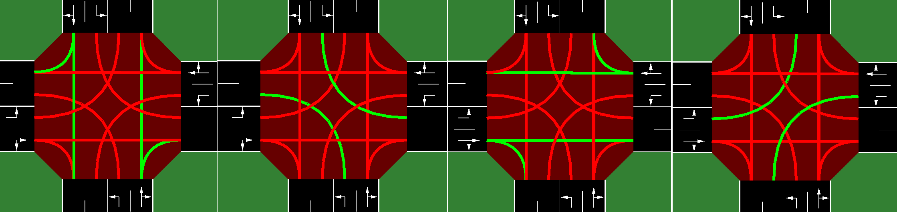
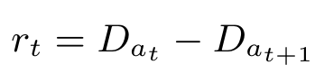

# SUMO-RL

SUMO-RL provides a simple interface to instantiate Reinforcement Learning environments with [SUMO](https://github.com/eclipse/sumo) for Traffic Signal Control. 

### Install SUMO-RL

Stable release version is available through pip
```bash
pip install sumo-rl
```

Recommended: alternatively you can install using the latest (unreleased) version
```bash
git clone https://github.com/LucasAlegre/sumo-rl
cd sumo-rl
pip install -e .
```

## MDP - Observations, Actions and Rewards

### Observation
The default observation for each traffic signal agent is a vector:
```python
    obs = [phase_one_hot, min_green, lane_1_density,...,lane_n_density, lane_1_queue,...,lane_n_queue]
```
- ```phase_one_hot``` is a one-hot encoded vector indicating the current active green phase
- ```min_green``` is a binary variable indicating whether min_green seconds have already passed in the current phase
- ```lane_i_density``` is the number of vehicles in incoming lane i dividided by the total capacity of the lane
- ```lane_i_queue```is the number of queued (speed below 0.1 m/s) vehicles in incoming lane i divided by the total capacity of the lane

You can define your own observation changing the method 'compute_observation' of [TrafficSignal](https://github.com/LucasAlegre/sumo-rl/blob/master/sumo_rl/environment/traffic_signal.py).

### Actions
The action space is discrete.
Every 'delta_time' seconds, each traffic signal agent can choose the next green phase configuration.

E.g.: In the [2-way single intersection](https://github.com/LucasAlegre/sumo-rl/blob/master/experiments/dqn_2way-single-intersection.py) there are |A| = 4 discrete actions, corresponding to the following green phase configurations:

<p align="center">

</p>
    
Important: every time a phase change occurs, the next phase is preeceded by a yellow phase lasting ```yellow_time``` seconds.

### Rewards
The default reward function is the change in cumulative vehicle delay:

<p align="center">

</p>
    
That is, the reward is how much the total delay (sum of the waiting times of all approaching vehicles) changed in relation to the previous time-step.

You can choose a different reward function (see the ones implemented in [TrafficSignal](https://github.com/LucasAlegre/sumo-rl/blob/master/sumo_rl/environment/traffic_signal.py)) with the parameter `reward_fn` in the [SumoEnvironment](https://github.com/LucasAlegre/sumo-rl/blob/master/sumo_rl/environment/env.py) constructor. 

It is also possible to implement your own reward function:

```python
def my_reward_fn(traffic_signal):
    return traffic_signal.get_average_speed()

env = SumoEnvironment(..., reward_fn=my_reward_fn)
```
### Single Agent Environment

If your network only has ONE traffic light, then you can instantiate a standard Gym env (see [Gym API](https://www.gymlibrary.dev/content/basic_usage/)):
```python
import gym
import sumo_rl
env = gym.make('sumo-rl-v0',
                net_file='path_to_your_network.net.xml',
                route_file='path_to_your_routefile.rou.xml',
                out_csv_name='path_to_output.csv',
                use_gui=True,
                num_seconds=100000)
obs, info = env.reset()
done = False
while not done:
    next_obs, reward, terminated, truncated, info = env.step(env.action_space.sample())
    done = terminated or truncated
```

@misc{sumorl,
    author = {Lucas N. Alegre},
    title = {{SUMO-RL}},
    year = {2019},
    publisher = {GitHub},
    journal = {GitHub repository},
    howpublished = {\url{https://github.com/LucasAlegre/sumo-rl}},
}


